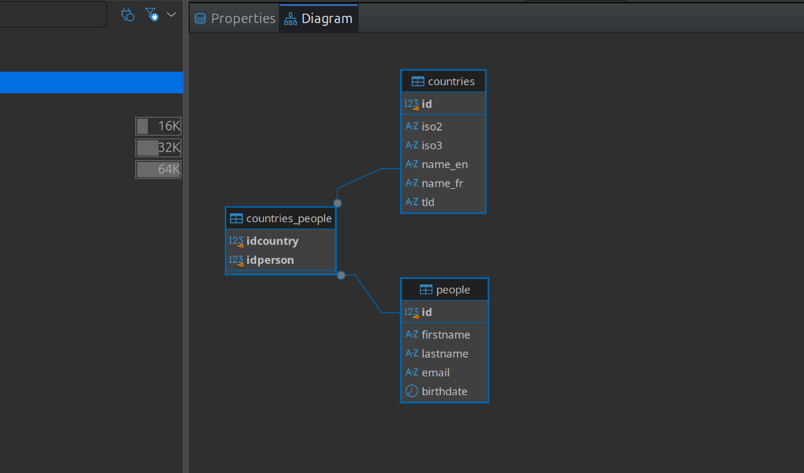

# HelloDojo Marketing

Ce fichier permet de consigner et documenter les étapes que vous avez suivies
pour répondre aux demandes du [README.md](README.md).

<!-- 
Note: de manière générale vous devez remplacer toutes les requêtes SQL,
les `XXX`, `NUMBER`, `TEXT` ou `NAME`.
-->

## Mise en place

<!-- 
Vous devez expliquer ici quelle solution technique vous avez choisie, comment
il faut procéder pour l'installer, quelles sont les commandes ou les étapes à
suivre pour importer les tables, quel outil vous avez utilisé pour créer le
schéma entité-relation de la base, et toutes autres informations qui pourraient
vous sembler utiles dans le but qu'une autre personne puisse **reproduire** 
votre démarche.
-->

Voici les étapes que j'ai suivies pour installer MariaDB, créer une base de données
et y importer les tables :
  1. Il était deja installé -> `mysql -u root -p`

J'ai choisi d'utiliser DBeaver comme client de base de données.

J'ai généré le schéma avec DBeaver:



## Informations à récolter

### Générales

1. La table `people` contient `NUMBER` personnes, ma requête est :  
  ```sql
  select count(*) from people;
  ```
1. Cette requête permet de trouver l'email de la personne dont le nom de
   famille est "Warren" :
  ```sql
  select email from people where lastname = 'Warren';
  ```
1. La table `people` est triée par nom de famille en ordre croissant, ma requête 
   est :  
  ```sql
  select * from people order by lastname asc;
  ```
1. Les 5 premières entrées de la table `people` triée par nom de famille en 
   ordre croissant sont :  
  ```sql
  select * from people order by lastname limit 5;
  ```
1. Je trouve toutes les personnes dont le nom ou le prénom contient `ojo`, ma requête est :  
  ```sql
  select * from people where firstname like '%ojo%' or lastname like '%ojo%';
  ```
1. Les 5 personnes les plus jeunes sont obtenues avec cette requête :  
  ```sql
  select * from people order by birthdate desc limit 5;
  ```
1. Les 5 personnes les plus agées sont obtenues avec cette requête :  
  ```sql
  select * from people order by birthdate asc limit 5;
  ```
1. La requête suivante permet de trouver l'age (en année) de chaque personne :  
  ```sql
  select *, timestampdiff(year, birthdate, curdate()) as age from people;
  ```
1. La moyenne d'age (en année) est `32`, ma requête est :  
  ```sql
  select round(avg(timestampdiff(year, birthdate, curdate()))) as age from people;
  ```
1. Le prénom le plus long est `Clementine`, ma requête est :  
  ```sql
  select firstname from people order by length(firstname) desc limit 1;
  ```
1. Le nom de famille le plus long est `Christensen`, ma requête est:  
  ```sql
  select lastname from people order by length(lastname) desc limit 1;
  ```
1. La plus longue paire "nom + prénom" est `Cheyenne Pennington`, ma requête est : 
  ```sql
  select firstname, lastname from people order by length(firstname) + length(lastname) desc limit 1;
  ```
1. La table `people` contient `10` doublons, ma requête est :  
  ```sql
  select count(*) from (select firstname, lastname, email from people group by firstname, lastname, email having count(*) > 1) as doublons;
  ```

### Invitations

1. Pour lister tous les membres de plus de 18 ans :  
  ```sql
  select *, timestampdiff(year, birthdate, curdate()) as age from people hving age >= 18;
  ```
1. Pour lister tous les membres de plus de 18 ans et de moins de 60 ans :  
  ```sql
  select *, timestampdiff(year, birthdate, curdate()) as age from people having age >= 18 and age < 60;
  ```
1. Pour lister tous les membres de plus de 18 ans, de moins de 60 ans et qui 
   une addresse email valide :  
  ```sql
  select *, timestampdiff(year, birthdate, curdate()) as age from people having age >= 18 and age < 60 and email like '%_@__%.__%';
  ```
1. Pour ajoutez une colonne `age` dans le résultat de la requête :  
  ```sql
  select *, timestampdiff(year, birthdate, curdate()) as age from people having age >= 18 and age < 60 and email like '%_@__%.__%';
  ```
1. Pour générer un champs contenant `Prénom Nom <email@provider.com>;` :  
  ```sql
  select concat(firstname, ' ', lastname, ' <', email, '>') as contact from people;
  ```
1. Avec cette requête :  
  ```sql
  select count(*) from people join countries_people on people.id = countries_people.idperson join countries on countries_people.idcountry = countries.id where countries.name_fr = 'Suisse';
  ```  
  je peux estimer que `371` personnes habitent en Suisse.

### Countries

1. La requête qui permet d'obtenir la liste d'options sous la forme :  
   `<option value="XXX">XXX</option>` est :  
  ```sql
  select concat('<option value="', id, '">', name_fr, '</option>') as option from countries;
  ```
1. Pour avoir la liste d'options en plusieurs langues, je procède de la manière 
   suivante :  
  ```sql
  select concat('<option value="', id, '">', if(@lang = 'en', name_en, name_fr), '</option>') as option from countries;
  ```

### Jointure

1. Avec cette requête :  
  ```sql
  select count(*) from people join countries_people on people.id = countries_people.idperson join countries on countries_people.idcountry = countries.id where name_fr = 'Suisse';
  ```    
   je sais que `371` personnes habitent en Suisse.
1. Avec cette requête :  
  ```sql
  select count(*) from people join countries_people on people.id = countries_people.idperson join countries on countries_people.idcountry = countries.id where name_fr != 'Suisse';
  ```  
   je sais que `43` personnes n'habitent pas en Suisse.
1. Avec cette requête :  
  ```sql
  select firstname, lastname from people join countries_people on people.id = countries_people.idperson join countries on countries_people.idcountry = countries.id where name_fr = 'France' or name_fr = 'Allemagne' or name_fr = 'Italie' or name_fr = 'Autriche' or name_fr = 'Liechtenstein';

  ```  
  je liste (nom & prénom) les membres habitants de France, Allemagne, Italie, Autriche et Liechtenstein.
1. Cette requête :  
  ```sql
  select name_fr, count(*) from people join countries_people on people.id = countries_people.idperson join countries on countries_people.idcountry = countries.id group by name_fr;
  ```  
   permet de compter combien il y a de personnes par pays.
1. Cette requête :  
  ```sql
  select name_fr, count(people.id) from countries left join countries_people on id = countries_people.idcountry left join people on countries_people.idperson = people.id group by name_fr having
  count(people.id) = 0;
  ```  
  liste les pays qui ne possèdent pas de personnes.
1. En exécutant cette requête :  
  ```sql
  select people.firstname, people.lastname from people join countries_people on people.id = countries_people.idperson join countries on countries_people.idcountry = countries.id group by people.id, people.firstname, people.lastname having count(countries_people.idcountry) > 1;
  ```  
   je sais que `Dai` et `Minerva` sont liés à plusieurs pays.
1. De la manière suivante :  
  ```sql
  select name_fr, count(*) * 100.0 / sum(count(*)) over () as pourcentage from people join countries_people on people.id = countries_people.idperson join countries on countries_people.idcountry
  = countries.id group by name_fr;
  ```  
  nous pouvons afficher le pourcentage de personnes par pays.


### Procédures

1. Cette requête permet d'extraire le `tld` de l'adresse email et de le lier à la table `countries` :  
```sql
  select people.firstname, people.lastname, people.email, countries.name_fr from people join countries on concat('.', substring_index(people.email, '.', -1)) collate utf8mb3_general_ci = countries.tld collate utf8mb3_general_ci;
```  
1. Pour ajouter une chaine si la jointure ne retourne rien, j'ai procédé de la manière suivante :  
  `ifnull()`
1. Avec `CREATE FUNCTION`, nous pouvons partager le mécanisme qui extrait le `tld`.
```sql
create function get_tld(p_email varchar(255)) returns varchar(10) deterministic begin return concat('.', substring_index(p_email, '.', -1)); end;
```
### Vue SQL

1. J'ai créé une vue bien pratique contenant toutes les informations utiles à un humain. Ma requête est:  
```sql
create view HelloDojo as select people.*, timestampdiff(year, people.birthdate, curdate()) as age, concat(people.firstname, ' ', people.lastname) as full_name, countries.name_fr as pays from people left join countries_people on people.id = countries_people.idperson left join countries on countries_people.idcountry = countries.id;
```  
1. Je peux exporter ma vue au format CSV avec la requête :
```sql
select * from HelloDojo
into outfile '/tmp/hellodojo.csv'
fields terminated by ','
enclosed by '"'
lines terminated by '\n';
```
### Finances

1. J'ai créé une table pour les finances. Ma requête est:  
  ```sql
  create table expenses (id int auto_increment primary key, idperson int not null, amount decimal(10,2) not null, description varchar(255), expense_date date not null default (curdate()), foreign key (idperson) references people(id));
  ```
1. J'ai ajouté des données de test avec la reuêtes SQL suivante :  
```sql
insert into expenses (idperson, amount, description, expense_date) values (100, 25.00, 'Carte de membre', '2026-01-15'), (100, 10.50, 'Bon d''achat', '2026-02-03'), (101, 25.00, 'Carte de membre', '2026-01-20'), (102, 50.00, 'Bon d''achat', '2026-03-10');
   ```
1. J'ai modifié la vue en y ajoutant les finances. Ma requête est:  
  ```sql
  create or replace view HelloDojo as select people.*, timestampdiff(year, people.birthdate, curdate()) as age, concat(people.firstname, ' ', people.lastname) as full_name, countries.name_fr as pays, coalesce(sum(expenses.amount), 0) as total_depenses from people left join countries_people on people.id = countries_people.idperson left join countries on countries_people.idcountry = countries.id left join expenses on people.id = expenses.idperson group by people.id, countries.name_fr;
  ```

### Intégrité référentielle
(WIP)
1. Pour ajouter les clés étrangères, j'ai utilisé les requêtes suivantes :  
  ```sql
  select constraint_name, column_name, referenced_table_name, referenced_column_name from information_schema.key_column_usage where table_name = 'countries_people' and referenced_table_name is not null;
  ```
1. J'ai pas du modifier les données d'une table.
